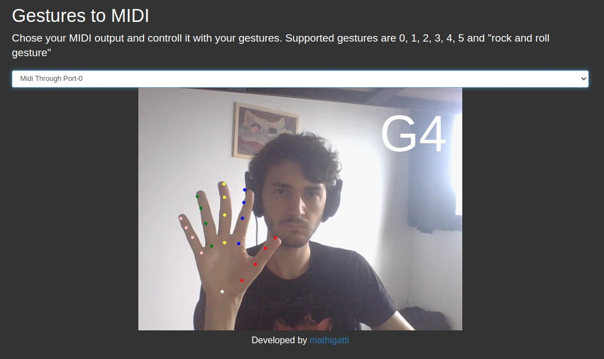
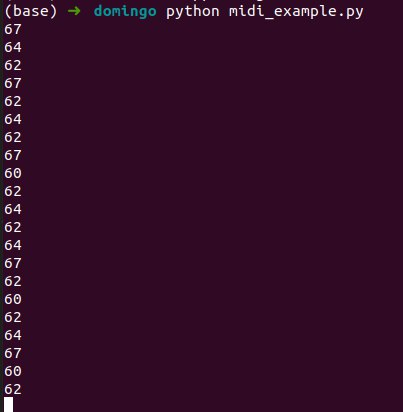

# gestures2anything

User your webcam to identify gestures and trigger python scripts



# How it works?

Using [this](http://gestos.mathigatti.com/) website you can identify 6 basic gestures and receive their MIDI code into your computer. `midi_example.py` is a simple script that receives the messages and prints them. You can replace the print statement for anything else you want.

For more details about the website development check [this repository](https://github.com/mathigatti/GesturesController).

# Requirements

- Python 3
- Some python modules (Try something like `pip install -r requirements.txt`)

# Usage

First run the script.

```python midi_example.py```

Then go to [the website](http://gestos.mathigatti.com/) and modify the selection bar in order to choose the midi output (Instead of `None`).

Once that's setted up tt should generate something like this


